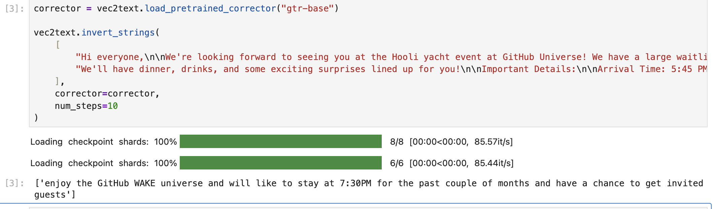

I was recently asked to determine the sensitivity of embeddings generated from proprietary code. While it seemed natural to think that embeddings were one-way functions that could not be reversed, research revealed that substantial semantic leakage was possible—even if direct reconstruction was not.

Embeddings turn a **token**—a word, subword, or symbol— into a vector that encodes its semantic meaning. However, these vectors are not unique; multiple tokens can map to the same vector, and as such are a [lossy function](https://en.wikipedia.org/wiki/Lossy_compression). Embeddings generated from longer sequences, like sentences or paragraphs, lose even more data, as the  [sequence embedding techniques](https://blog.ml6.eu/the-art-of-pooling-embeddings-c56575114cf8) compress more information into the same vector space, leading to even more collisions, like squishing a bunch of different photos into a single blurry thumbnail.

Given this lossiness, it may appear as if it is impossible to reconstruct the sequence used to generate an embedding. However, recent research indicates that embeddings can be reversed in certain situations.

*Text Embeddings Reveal (Almost) As Much As Text*[^1] found that dense text embeddings (short sequences with lots of information) could be inverted back to the source text *exactly* in certain cases. This methodology was extended in *Universal Zero-shot Embedding Inversion*[^2], which aimed to extract semantic information about the underlying text rather than fully reconstructing sequences. Both approaches proved ineffective for larger sequence sizes; optimal inversion was with 16–32 token sequences.

Code embeddings are [slightly different](https://medium.com/@abhilasha4042/code-isnt-just-text-a-deep-dive-into-code-embedding-models-418cf27ea576) from text embeddings because they have different grammatical rules and contain semantic information in slightly different ways (`for (int i = 0; i < array.length; i++)` and `array.forEach(item -> ...)` are the same despite being different sequences). However, the general intuition and concerns remain the same as for general text. Comments, variable names, and variable values were extractable for short code sequences when I tested using the vec2text utility.

However, these research findings apply mainly to short embedding chunks. Most modern RAG (Retrieval-Augmented Generation) systems use [300-500 token](https://docs.aws.amazon.com/bedrock/latest/userguide/kb-chunking.html#:~:text=Splits%20content%20into%20text%20chunks%20of%20approximately%20300%20tokens) chunks, while the research above performs best with 16-32 token chunks. In my own testing using the [`gtr-base` model](https://huggingface.co/sentence-transformers/gtr-t5-base) with the [vec2text](https://github.com/vec2text/vec2text) utility, the performance of embedding reversal degrades significantly after 50 tokens; information recall drops sharply above 100 tokens, with semantic inversion becoming very unreliable. 

Although embeddings cannot be fully reversed currently, the research above shows that substantial semantic information can still be extracted. What does this mean for data classification and data protection?

Given that **full data inversion** for text is currently considered impossible, code embeddings also cannot be fully inverted. However, sensitive data within the code, such as comments and variables, may be at risk of **partial inversion attacks**. A partial inversion attack refers to recovering sensitive semantic data from an embedding vector, even if the full code or text cannot be reconstructed.

When threat modeling your embeddings, consider the following questions:

* How long are your embedding chunks? 
  * Longer chunks (300+ tokens) are less susceptible to direct inversion, but partial semantic extraction is still a risk.
* Does semantic meaning matter, or the exact data?
  * Datasets with sensitive content (PII, internal notes) may be at risk; cryptographic keys and highly exact data remain safe for now.
* Do you care about future-proofing your data?
  * Two futures are possible: either embedding dimensions increase (making inversion harder), or inversion techniques improve. The conservative approach is to plan for both.

Given all of the above findings, I’d recommend classifying embedding data at the same level as the data it was created from. Semantic data can be exfiltrated from embeddings, which poses a risk for most use cases. It is therefore critical to apply appropriate [data protection measures to embeddings](https://milvus.io/ai-quick-reference/what-encryption-standards-are-recommended-for-vector-storage), ensuring they are secured as rigorously as their source data.

This can be handled by enabling encryption at rest in your cloud offering or implementing [your own solution for local embeddings](https://sec.cloudapps.cisco.com/security/center/resources/securing-vector-databases#Encryption). In most cases, simple encryption at rest should suffice. For those seeking an additional layer of safety, there is some highly experimental work in distance-preserving encryption[^3] being implemented by [CloakedAI](https://ironcorelabs.com/products/cloaked-ai/). 

In summary:

* Treat embeddings with the same care you treat the data from which it was generated.
* Employ strong data protections for embeddings, with encryption at rest and in transit.

[^1]: https://arxiv.org/abs/2310.06816
[^2]: https://arxiv.org/abs/2504.00147v1
[^3]: https://eprint.iacr.org/2021/1666
